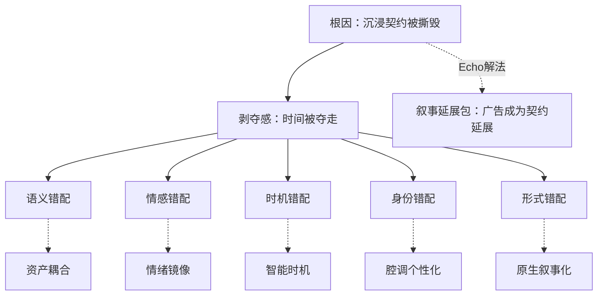
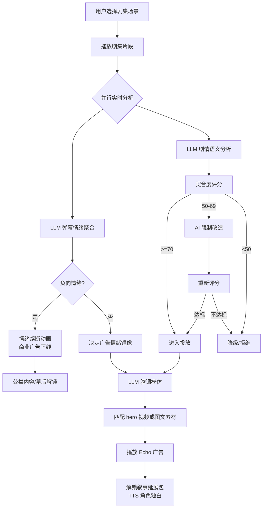

# 腾讯 PCG 校园 AI 创意大赛 · 方案规划 v4

> v4 在 v3 基础上的三刀 sharpening：
>
> 1. **LLM 架构升级**：双模型架构（OpenAI-compatible 实时 + Claude 离线精修 Prompt 模板），代码层"认接口不认厂商"
> 2. **情绪熔断动画**：负向情绪触发时全屏熔断，从"切换内容"升级为"视觉震撼瞬间"
> 3. **错误配对→AI 修复闭环**：拦截不是终点，加"AI 改造引擎"把 34 分救回 72 分，闭环+增值服务双赢
> 4. **Day 3 硬止损**：视频生成 6 小时未达标自动降级图文，"有备案的自信"
> 5. **演示视频 5 幕脚本**：3 分 30 秒，痛点→方案→交互→闭环→原则，节奏定死

---

## 一、产品核心定位

**产品名**：**Echo（回声）**

**一句话定义**：Echo 不是"把广告做得更好看"的广告优化工具，**Echo 是视频平台的"品味守门人"——让广告从"撕毁沉浸契约的入侵者"变成"延展剧集叙事的回声"**。

**三大核心机制**（每一条都对应一个 Demo 可交互的体验）：

1. **情绪镜像（Emotion Mirror）** — AI 读弹幕+读剧情，广告色调/文案/节奏自动响应；负向情绪触发**全屏熔断**
2. **叙事资产耦合 + 腔调模仿** — 同品牌三腔调改写 + **错误配对→AI 修复**完整闭环
3. **叙事延展包（Narrative Extension Pack）** — 品牌方付费购买 AI 延展叙事，平台+IP 方分成

---

## 二、用户痛点 · 双层归因

### 🎯 底层痛点：剥夺感（Deprivation）

### 🎯 更底层的原因：沉浸契约被撕毁（Immersion Contract Breach）

**为什么长视频用户比短视频用户更恨广告？**

- 短视频：用户与平台签的是"即时满足契约"，广告是可接受的延迟成本
- 长视频：用户与剧集签的是**"沉浸契约"**——花 40 分钟建立情感投入、进入角色视角，广告是对这份契约的暴力撕毁

→ Echo 的根本解法：把广告**写进契约里**（资产耦合）+ 把广告变成**契约的延展**（叙事延展包）。

**这个视角把方案从"广告优化"升维到"沉浸经济学"。**

### 错配树




---

## 三、AI 方案核心功能

### 功能 1：剧情语义理解引擎（Scene Intelligence）

- **输入**：剧集片段字幕 + 离线预跑的多模态分析（Qwen-VL / GPT-4o 缓存）
- **输出示例**：

```json
{
  "genre": "武侠古装",
  "emotion_curve": "紧张→释然",
  "tone": "范闲体·半文半白·吐槽",
  "tension": 0.82,
  "relaxed_window": "+42s",
  "reusable_assets": ["范闲独白", "鉴查院腰牌", "庆帝的冷笑"]
}
```

### 功能 2：情绪镜像（Emotion Mirror）★ v4 加入熔断动画 ★

**Demo 真交互（v3 基础上强化）**：

- 弹幕输入框允许评委现场任意输入
- 三类响应：
  - 虐心情绪主导 → 广告色调变暖、文案走治愈系
  - 爽感情绪主导 → 广告节奏变快、文案走爽文逆袭
  - **负向情绪主导 → 触发"情绪熔断"全屏动画** ★

**情绪熔断动画（v4 新增）**：

1. 屏幕瞬间变暗，出现红色警告条纹
2. 大字弹出：**"情绪熔断触发 — 本时段商业广告已强制下线"**
3. 下方小字：**"原因：当前弹幕情绪聚合显示'厌恶'主导（置信度 0.87），符合平台治理规则第 3 条：用户情绪极度负面时，平台有义务停止商业打扰。"**
4. 然后自动切换到"幕后花絮解锁"或"无广告剧集继续"
5. 整个熔断动画 2-3 秒，必须拍进演示视频，**这是"平台治理不是空话"的终极证明**

### 功能 3：叙事资产耦合 + 腔调模仿 ★ v4 加入 AI 修复闭环 ★

**v3 已有**：同卖点（快充 · 30 秒续 10 小时）三腔调改写：


| 剧集    | 腔调  | 文案                                            |
| ----- | --- | --------------------------------------------- |
| 庆余年 2 | 范闲体 | "这世上本无快慢，只是等不了的人太多。三十秒，续上十个时辰—— 比我当年跑过京都城还快。" |
| 三体    | 罗辑体 | "黑暗森林里，电量是文明的底气。三十秒，一个夜晚的安全区。"                |
| 繁花    | 宝总体 | "做生意讲究个'随时能接电话'。侬这手机没电，等于把面子关进抽屉。三十秒，面子就回来。"  |


**v4 升级：错误配对的完整闭环（不止拦截，还要修复）**

Demo 中提供"错配测试"按钮，评委可故意让 AI 用**宝总体写科幻广告**或**罗辑体写校园剧广告**：

**阶段 1：拦截**

- AI 诚实输出尴尬结果（如"三体文明的做生意面子..."）
- 契合度评分：34/100
- 系统拦截，屏幕提示："**该配对已被平台治理系统拦截**"

**阶段 2：AI 修复（v4 新增）**

- 拦截后出现按钮："Echo 的'强制改造引擎'可尝试挽救—— 是否查看 AI 改造方案？"
- 评委点击 → 2 秒内 LLM 重新生成：
  - 将"宝总体+科幻"软化为"科幻语境下的商人视角"（不硬用沪语腔，而是抽取"商战思维"作为切入点）
  - 评分从 34 → 72
- 系统提示："**改造通过，进入正常流量池**"

**潜台词**（写进文档）：

> "Echo 不只是守门人，还是**教练**—— 帮广告主从'不及格'升到'及格'。这既是闭环设计，也是**商业增值服务**：广告主愿意为'被改造到及格'额外付费，平台再多一个 SaaS 式收入来源。"

**实现真相（v4 诚实升级）**：

- LLM 文案生成：实时调用
- 视觉素材：混合方案 + **Day 3 硬止损机制**
  - 《庆余年 2》：优先 1 段 5-8 秒 AI 视频（即梦/可灵精修）
  - **Day 3 硬止损**：6 小时内未达"人物不露手、背景不闪烁、风格统一"标准 → 立即降级为"叙事卡片旗舰版"（3 张高质量 AI 生图 800ms 轮播 + 视差 + 强音效）
  - 《三体》《繁花》：动态图文广告（静帧+流式文案+转场+音效）
- **战略性放弃声明**（文档金句）：
  > "本方案在当前阶段主动放弃'实时视频生成'这一伪需求。Echo 选择'实时决策 + 预合成素材库'架构，不是技术妥协，是对技术边界的清醒认知。待 12-18 个月后视频生成实时化成熟，本架构可无缝迁移为全链路实时生成，无需重构。"
  >
  > "Hero 视频采用'视频优先、图文兜底'策略。若 AI 视频在生成窗口内未达可用标准，自动降级为叙事卡片旗舰版，在 Demo 场景下视觉冲击力与短视频等效。——**这叫有备案的自信**。"

### 功能 4：叙事延展包（Narrative Extension Pack）

**商业模型**：

- 叙事延展包是**品牌方付费购买的增值产品**，不是平台让利
- 内容是 **AI 生成的"该品牌广告的隐藏叙事"**（用角色腔调+TTS，不动用剧集版权资产）
- **收入分配**：品牌方付基础广告 + 延展包溢价；平台抽成 30%；IP 方分成 10%
- **品牌方动机**：获得 AI 生成的"品牌定制平行剧情"作为**二次传播素材**（可剪到短视频平台，反向获得 UGC 曝光）

**用户体感**：看完广告 → "🔑 已解锁：范闲独白·关于承诺 (00:28)" → **体感上仍是"多得到一个东西"**，但这个东西是**品牌方买单的**。

### 功能 5：智能插入时机（Smart Timing）

基于情绪曲线识别"自然呼吸点"（场景转换 / 情绪谷底 / 对白停顿）。

### 功能 6：平台治理仪表盘（Taste Guardian Dashboard）

- 左：品牌素材池（奢侈品 / 快销 / 3C / 金融 共 8-10 个）
- 右：剧集池（庆余年 / 三体 / 繁花）
- 中：拖拽组合 → 实时契合度评分
- 决策：≥70 正常流量池 / 50-69 强制改造 / <50 降级或拒绝
- 金句横幅：**"品味守门人：不达标的广告，连被讨厌的资格都没有。"**

---

## 四、技术架构 ★ v4 LLM 双模型架构 ★

### LLM 架构设计（"认接口不认厂商"）

**核心原则**：代码层严格基于 **OpenAI-compatible 接口**开发，不耦合任何具体厂商 SDK。部署时通过环境变量切换 `OPENAI_BASE_URL` 和 `OPENAI_API_KEY` 即可适配任意兼容厂商（DeepSeek / Kimi / 通义 / 智谱 / 本地 vLLM 等）。

```
┌──────────────────────────────────────────────────────────────┐
│ 实时链路（Runtime）：OpenAI-compatible API                    │
│ 用途：剧情分析、腔调模仿、弹幕情绪聚合、契合度评分、AI 修复   │
│ 要求：延迟 <800ms、国内可直连、成本可控                        │
│ 候选：DeepSeek-V3 / Kimi K1.5 / 通义千问 Max                  │
└──────────────────────────────────────────────────────────────┘
                              ↑ 调用时读取
┌──────────────────────────────────────────────────────────────┐
│ 离线链路（Offline）：Claude 3.5 Sonnet                        │
│ 用途：一次性生成 3 套角色 Prompt 模板（范闲体/罗辑体/宝总体） │
│ 产物：prompts/roles.json，提交到代码仓，无需再调用            │
│ 优势：Claude 文学腔调最强，但只在开发期用，不影响运行时稳定   │
└──────────────────────────────────────────────────────────────┘
```

**文档金句**：

> "Echo 采用**双模型架构**：运行时使用 OpenAI-compatible 接口（低延迟 <800ms、高可用、低成本），开发期使用 Claude 3.5 Sonnet 离线精修角色 Prompt 模板。该架构兼顾**文学精度**与**工程稳定性**—— 这是对 LLM 商用落地的清醒认知。"

### 完整技术栈

- **前端**：Next.js 14 (App Router) + Tailwind CSS + shadcn/ui + Framer Motion（熔断动画）
- **视频播放器**：原生 `<video>` + 自定义弹幕层
- **后端**：Next.js API Routes（Serverless）
- **LLM SDK**：官方 `openai` npm 包（`baseURL` 指向任意兼容厂商）
- **视频素材**：1 段 hero 视频（即梦/可灵，带图文兜底）+ 2 组动态图文
- **TTS**：OpenAI TTS 接口 或 豆包语音（同样 OpenAI-compatible 优先）
- **部署**：Vercel + Cloudflare R2 / 腾讯云 COS

---

## 五、Demo 页面结构（5 屏）

#### 屏 1：场景选择首屏

3 个剧集卡片 + 统一品牌（XX 手机快充）投放需求；hover 预览同品牌三腔调文案差异。

#### 屏 2：核心对比屏

左屏改造前硬切硬广 × 右屏 Echo 自然过渡；底部 AI 决策面板流式可视化（剧情识别 → 弹幕聚合 → 时机 → 风格 → 资产 → 文案流式生成）。

#### 屏 3：情绪镜像现场交互屏

弹幕输入框；预设 A（虐心）/B（爽感）按钮 + 评委自由输入；负向情绪触发**全屏熔断动画**。

#### 屏 4：错误配对 + 治理仪表盘屏

- 上半：错误配对闭环演示（拦截 → AI 修复 → 挽救通过）
- 下半：拖拽式契合度评分仪表盘
- 金句："不达标的广告，连被讨厌的资格都没有"

#### 屏 5：三方价值屏 + 冲突场景 Q&A

CPM 公式动画推导 + 冲突场景硬核问答（奢侈品 3 倍出价买庆余年硬广接不接？答：不接）。

---

## 六、核心交互流程




---

## 七、演示视频 5 幕脚本（总 3:30）★ v4 新增 ★


| 时间        | 画面                                              | 旁白/字幕                             |
| --------- | ----------------------------------------------- | --------------------------------- |
| 0:00-0:15 | 黑屏，大字："你讨厌广告，不是因为它丑" → 切"是因为它在撕毁你的沉浸契约"         | 无旁白，纯文字+环境音                       |
| 0:15-0:45 | 屏 2 核心对比：左屏硬广砸下，右屏 Echo 自然过渡                    | "Echo 不是优化广告，是重新定义广告与内容的边界"       |
| 0:45-1:15 | 屏 3 情绪镜像：评委现场输入弹幕 → AI 实时变色 → **打入负向弹幕 → 熔断动画** | "同一个广告，两张脸。AI 在乎的是你现在的感受"         |
| 1:15-1:45 | 屏 4 错误配对 + 治理仪表盘：错配 → 拦截 → **AI 修复通过**          | "Echo 不仅会做对的事，还能识别什么是错的，并把它改对"    |
| 1:45-2:15 | 叙事延展包解锁：看完广告 → TTS 范闲独白                         | "广告从'剥夺'变成'馈赠'——但馈赠是品牌方买单，不是平台让利" |
| 2:15-2:45 | 屏 5 三方价值：CPM 公式动画展开                             | "情感溢价 CPM +42%，这不是推算，这是新定价权"      |
| 2:45-3:15 | 冲突 Q&A：奢侈品 3 倍出价硬广，接不接？ → **不接**                | "这不是算数问题，这是产品原则"                  |
| 3:15-3:30 | 黑屏：Echo logo + "广告是剧集的回声，不是打断"                  | 结束                                |


**节奏逻辑**：痛点升维 → 解决方案 → 真交互证明 → 闭环展示 → 商业闭环 → 原则表态。

---

## 八、三方价值

**CPM 公式化推导**：

```
传统 CPM = 曝光次数 × 基础单价
Echo CPM = 曝光次数 × 基础单价 × 情绪契合系数(0.7-1.5) × 弹幕正向率系数(0.8-1.3) × 叙事延展溢价(1.0-1.5)
```

**数据可视化**（模拟数据，文档注明推算来源）：

- **用户**：跳过率 ↓67% · 弹幕正面提及率 ↑5.2x · 广告回看率（史上第一次）
- **平台**：情感溢价 CPM +42% · 用户留存 +12% · 广告时段弹幕活跃 ↑3.1x
- **品牌方**：品牌记忆度 ↑3.2x · 延展包自发剪辑传播 ↑8x

**冲突场景 Q&A**：

> 奢侈品牌坚持在《庆余年》高潮处插硬广，出价 3 倍，接不接？
> **答**：不接。或接但强制 AI 改造，改造后契合度仍不达标则原价退回。
> **理由**：一次高价低契合的投放，损失的是用户对平台的沉浸契约信任。**这不是算数问题，是产品原则。**

---

## 九、为什么必须用 AI

- 腔调是语言高维特征（LLM 建模）
- 传统推荐不能"生成"（LLM 生成）
- 弹幕情绪聚合需要语义理解（LLM 聚合）
- 资产复用需要跨模态（多模态模型）
- 延展包需要角色化写作（LLM + TTS）
- 契合度评分需要深度语义匹配（LLM 打分）
- **AI 修复需要可控重写**（LLM 约束生成）

---

## 十、风险与挑战

1. **版权与改编边界**：与 IP 方签「AI 叙事授权协议」
2. **负向情绪识别准确度**：多模型交叉验证 + 阈值调优
3. **契合度评分的博弈风险**：评分模型定期 retrain + 线下 A/B 验证
4. **叙事延展包内容幻觉**：三道防线（生成→人设一致性→合规审核）
5. **视频生成延迟**：战略性放弃实时视频
6. **冷启动**：48-72h 预制周期
7. **情绪镜像的伦理边界**：敏感话题禁用商业切换
8. **推广阻力**：头部品牌试点先行，示范效应

---

## 十一、10+ 天开发时间表 v4（4.21 → 5.6）


| 天数                  | 任务                                                                     | v4 关键                |
| ------------------- | ---------------------------------------------------------------------- | -------------------- |
| Day 1 (4.21)        | v4 定稿 + 开发环境 + **Claude 离线生成 3 套腔调 Prompt 模板**（存 `prompts/roles.json`） | 砍 Figma，Claude 只用于离线 |
| Day 2 (4.22)        | 剪 3 个剧集片段 + 写 3 组弹幕数据集（含负向测试用例）                                        | -                    |
| Day 3 (4.23)        | **庆余年 hero 视频生成，6 小时硬止损**                                              | 未达标立即降级图文            |
| Day 4 (4.24)        | 三体/繁花动态图文广告 + hero 视频图文兜底版本                                            | -                    |
| Day 5 (4.25)        | Next.js 骨架 + 视频播放器 + **OpenAI-compatible API 必须跑通**                    | Day 5 死线             |
| Day 6 (4.26)        | 场景选择屏 + 核心对比屏（流式 LLM 展示）                                               | -                    |
| Day 7 (4.27)        | **情绪镜像屏 + 熔断动画**                                                       | v4 重点                |
| Day 8 (4.28)        | **错误配对→AI 修复闭环 + 治理仪表盘**                                               | v4 重点                |
| Day 9 (4.29)        | 叙事延展包 + TTS + 三方价值屏（CPM 公式动画）                                          | -                    |
| Day 10 (4.30)       | 部署 Vercel + 联调 + 国内访问测试                                                | -                    |
| Day 11 (5.1)        | **按 5 幕脚本录制 3:30 演示视频**                                                | v4 重点                |
| Day 12-13 (5.2-5.3) | 写文档（沉浸经济学 + CPM + 战略放弃 + 冲突 Q&A + 双模型架构）                               | -                    |
| Day 14 (5.4)        | 非技术朋友试看（30 秒复述验收）                                                      | -                    |
| Day 15-16 (5.5-5.6) | 最终修订 + 提交缓冲                                                            | -                    |


---

## 十二、最终验收清单（贴显示器）

```
□ Day 1  Claude 离线生成 3 套角色 Prompt 模板 → prompts/roles.json
□ Day 3  6 小时硬止损：hero 视频未达标自动降级图文
□ Day 5  OpenAI-compatible API 跑通（实时 <800ms）
□ Day 7  情绪镜像：评委现场输入框 + 负向情绪全屏熔断动画
□ Day 8  错误配对：拦截 + AI 修复挽救（34→72）完整闭环
□ Day 8  治理仪表盘：拖拽 8+ 品牌 × 3 剧集，评分实时变化
□ Day 9  叙事延展包：解锁后 TTS 播放 30 秒角色独白
□ Day 10 Vercel 国内可访问，冷启动 <3 秒
□ Day 11 演示视频：3:30，5 幕，脚本完整
□ Day 12 文档含：沉浸经济学 + CPM 公式 + 战略放弃 + 冲突 Q&A + 双模型架构
□ Day 14 非技术朋友 30 秒内说出"情绪镜像/叙事延展包/品味守门人"其一
```

---

## 十三、v4 vs v3 升级对照


| 维度     | v3                  | v4                                           |
| ------ | ------------------- | -------------------------------------------- |
| LLM 策略 | 主 Claude 备 DeepSeek | **双模型架构：OpenAI-compatible 实时 + Claude 离线精修** |
| 代码耦合   | 绑定具体厂商              | **"认接口不认厂商"，环境变量切换**                         |
| 负向情绪   | 静默切换内容              | **全屏熔断动画（视觉震撼瞬间）**                           |
| 错误配对   | 仅拦截                 | **拦截 + AI 修复闭环（34→72）+ 增值服务商业解释**            |
| 视频风险   | 策略性放弃               | **Day 3 硬止损机制 + 图文兜底具体实施方案**                 |
| 演示视频   | 口号"5 幕"             | **3:30 定死脚本，每幕旁白/字幕全部写好**                    |
| 验收     | 笼统达标                | **可勾选的 11 项清单**                              |


---

## 十四、进入开发前最后确认

**已定（无需再讨论）**：

- ✅ 剧集：庆余年 2 / 三体 / 繁花
- ✅ 产品名：Echo
- ✅ 视频策略：1 hero + 2 动态图文 + Day 3 硬止损
- ✅ 商业模型：叙事延展包
- ✅ LLM 架构：OpenAI-compatible 实时 + Claude 离线精修（**用户确认"支持 openAI 接口就行"**）

**待提供（用户侧）**：

- ⏳ OpenAI-compatible API Key（用户表示后续提供，不阻塞开发启动）
- ⏳ 视频生成工具账号（即梦/可灵/通义万相，Day 3 需要）

**可并行开工的部分**（不需要 API Key）：

- Next.js 项目脚手架
- UI 骨架和页面布局
- 三套角色 Prompt 模板（用 Claude 离线产出，产物 JSON 化）
- 弹幕数据集
- 视频素材准备

**建议**：即刻切换到 Agent 模式，先启动"不依赖 API Key 的部分"，等用户提供 Key 后再接入实时链路。
