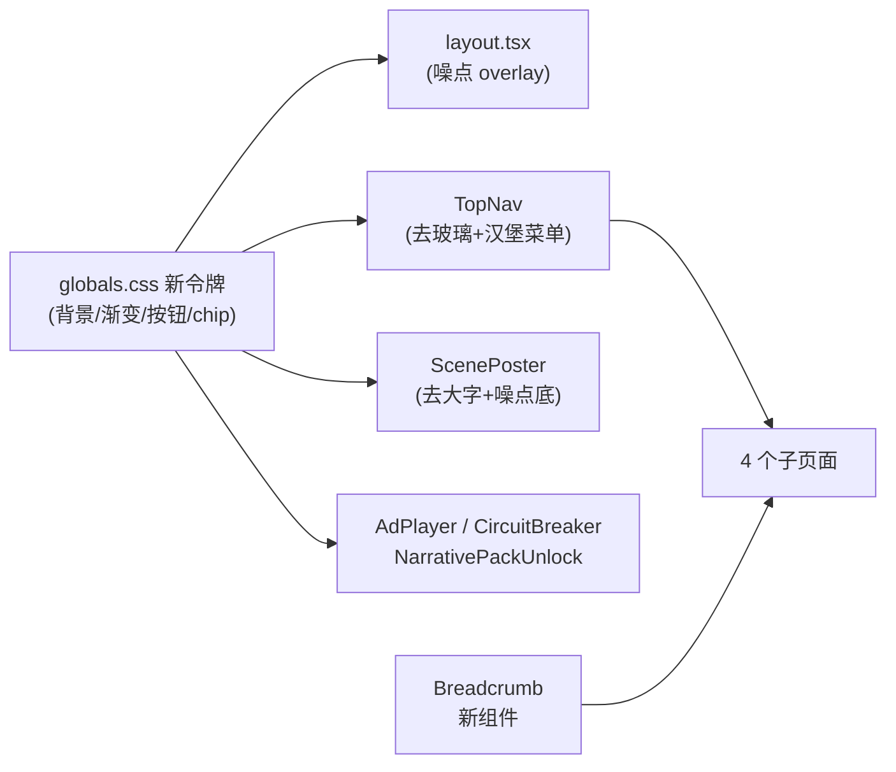

## 目标

1. **消除 AI 塑料味**：渐变只保留 1 处焦点、玻璃拟态全拆、大字水印全删、塑料按钮改米白极简、加纸质噪点背景
2. **修复导航缺失**：子页面 hero 顶部加面包屑 + TopNav 加移动端汉堡菜单
3. 保持所有 Demo 交互逻辑不动，只改视觉层

## 设计令牌（新）

| Token | 旧值                               | 新值                               |
| ----- | -------------------------------- | -------------------------------- |
| 背景主色  | `#0a0a0f`（冷黑）                    | `#0c0c0e`（暖深灰）+ 2% SVG 噪点        |
| 强调色   | 紫 `#7c5cff` + 橙 `#ff6b35`（双色渐变）  | **琥珀金 `#d4a574`**（单色）            |
| 主按钮   | 紫橙渐变 pill                        | 米白 `#f5f5f5` + 深色文字 + 6px 圆角     |
| 次按钮   | 边框 + 灰背景                         | **纯文字链接**，hover 底部 1px 线         |
| 卡片圆角  | 14px                             | 10px                             |
| chip  | pill + 色块填充                      | 1px 细边框 + 11px + 字间距 0.05em      |
| 文本分级  | text `#e7e7ef` / muted `#8a8a9a` | text `#ededed` / muted `#6b7280` |

## 需要改动的文件

### 1. 全局样式与配色

- [src/app/globals.css](src/app/globals.css)
  - 改 `html,body` 背景为 `#0c0c0e` + body::before 叠加 SVG noise data URI（2% opacity）
  - 删除 `.grad-echo` 的渐变实现（保留 class，改为纯白 + `text-shadow: 0 0 40px rgba(255,255,255,0.1)`）
  - 删除 `.glass`、`.glass-hi`（TopNav 与 NarrativePackUnlock 在用），改为 `background: rgba(12,12,14,0.88); border-bottom: 1px solid #1f1f23`
  - `.bordered-card` 圆角 14→10，背景去渐变改纯色 `#111113`，边框 `rgba(255,255,255,0.06)`
  - `.bordered-card-hi` 去掉紫橙渐变边框，改成 `1px solid rgba(212,165,116,0.35)`（琥珀金描边）
  - `.btn-primary` 改米白方案：`bg:#f5f5f5 color:#0a0a0f radius:6px`，hover 微上移 2px + shadow
  - 新增 `.btn-link`：无背景无边框，hover 底部细线（给次级 CTA 用）
  - `.chip` 去背景色，改 1px `rgba(255,255,255,0.15)` 边框 + 11px + letter-spacing 0.05em + 小型大写
  - 新增 `.divider-sub`：1px `#1f1f23` 分隔线
- [tailwind.config.ts](tailwind.config.ts)
  - 保留 `echo`/`accent`（色值改为琥珀金变体）避免组件大面积爆红
  - 新增 `amber: #d4a574` 作为语义色

### 2. 导航（核心功能修复）

- [src/components/TopNav.tsx](src/components/TopNav.tsx)
  - Logo 的 `bg-gradient-to-br from-echo to-accent` 改纯 `bg-white text-black`，或改为简洁的 `border` 方块
  - 去掉 `glass-hi`，用新的底色 + 下方 1px divider
  - 加**移动端汉堡菜单**（`md:hidden` 时显示 `<Menu>` 按钮，点击展开抽屉，抽屉里全部 5 个导航项 + LLM Status）
  - 非 home 页时，Logo 左侧加一个小的 `← 首页` 文字链接（更直觉）
- **新增** `src/components/Breadcrumb.tsx`
  - Props：`items: { label: string; href?: string }[]`
  - 样式：`text-xs text-muted` + `/` 分隔 + 最后一项不可点击
  - 在 4 个子页面 hero 顶部引入：
    - `/compare/[sceneId]`：首页 / 核心对比 / 庆余年 2
    - `/mirror/[sceneId]`：首页 / 情绪镜像 / 庆余年 2
    - `/governance`：首页 / 品味守门人
    - `/value`：首页 / 三方价值

### 3. 首页 Hero 与卡片

- [src/app/page.tsx](src/app/page.tsx)
  - 主标题字号从 `clamp(42px, 6vw, 84px)` 降到 `clamp(32px, 4.2vw, 58px)`，字重 700→600，行高 1.05→1.3
  - 「回声」去渐变（上面 globals.css 已改）
  - 副标题砍成一句："让广告继承剧集的腔调与情绪，而非撕毁它。"（去掉 `text-white` / `text-accent` 颜色高亮）
  - 三个 CTA：只留「进入 Demo →」为主按钮（新 btn-primary 米白方案），另外两个改 `btn-link`
  - 顶部两个 chip（大赛 / v4）：换成克制的 small-caps 标签，或直接砍掉只留 1 个
  - Hero 和 SCENE·01 之间加 80px 留白（从 `py-10` 改 `pt-20 pb-10`）
  - footer 从单行改为两行：上行大赛名 + Echo，下行版权与技术栈
  - `MechCard` 的圆角从 14 降到 10，hover 从 `border-echo/50` 改 `brightness 105%`
- [src/components/ScenePoster.tsx](src/components/ScenePoster.tsx)
  - **删除巨型意象字渲染**（motif 那块 div 整段删），保留 `scene.poster.motif` 数据字段不用即可（不改 data）
  - 背景从 `bgGradient` 改为：纯色底 `#141418` + 一层 radial-gradient 微光（主色 15% opacity，位于右上角） + 噪点 overlay
  - 原来的 `PatternLayer`（竖线 / 点阵 / 霓虹）保留但整体 opacity 降到 0.25
  - 扫描线去掉（`scan-line` 这条在海报上显得多余，留给 SceneVideoStub）
  - 标签 `badge-ip` 改为纯边框 11px 字间距加宽

### 4. 子页面顶部接入面包屑

每个子页面在 `<TopNav />` 下方插入 `<Breadcrumb items={...} />`：

- [src/app/compare/[sceneId]/page.tsx](src/app/compare/%5BsceneId%5D/page.tsx)
- [src/app/mirror/[sceneId]/page.tsx](src/app/mirror/%5BsceneId%5D/page.tsx)
- [src/app/governance/page.tsx](src/app/governance/page.tsx)
- [src/app/value/page.tsx](src/app/value/page.tsx)

### 5. 副作用排查（小改或无改）

这些组件用到了 `grad-echo` / `btn-primary` / `bordered-card-hi` / `glass` / `chip-echo` / `chip-accent`，由于 class 语义保留、视觉层在 globals.css 统一被改，理论上**无须触碰**；仅核对：

- `src/components/AdPlayer.tsx`
- `src/components/AIDecisionPanel.tsx`
- `src/components/CircuitBreaker.tsx`（熔断动画保留红色警告，这是语义色不动）
- `src/components/FitnessGauge.tsx`
- `src/components/NarrativePackUnlock.tsx`（有玻璃拟态遮罩，需要把 `glass-hi` 换成新的深色背景）

## 数据流与视觉层关系

## 验收标准

- 首页遮住 Logo 问自己「像不像腾讯视频功能页」——应该像，不像 AI SaaS 落地页
- 在子页面任意深度，顶部 1 秒内能找到"回主页"路径（桌面：Logo + 面包屑；移动：汉堡菜单 + 面包屑）
- 全局搜索 `linear-gradient\(135deg, #7c5cff` 应只在 `.grad-echo` fallback 或已清空
- `npm run build` 通过，0 错误
- 熔断动画的红色警告条纹保留（属于功能性语义色，不归入"AI 味"）

## 不改的部分

- 所有业务逻辑（LLM 调用、Mock、API 路由、情绪聚合、契合度评分）
- 数据文件（scenes / brands / danmaku / prompts）
- 交互事件（拖拽、流式输出、熔断触发条件）

